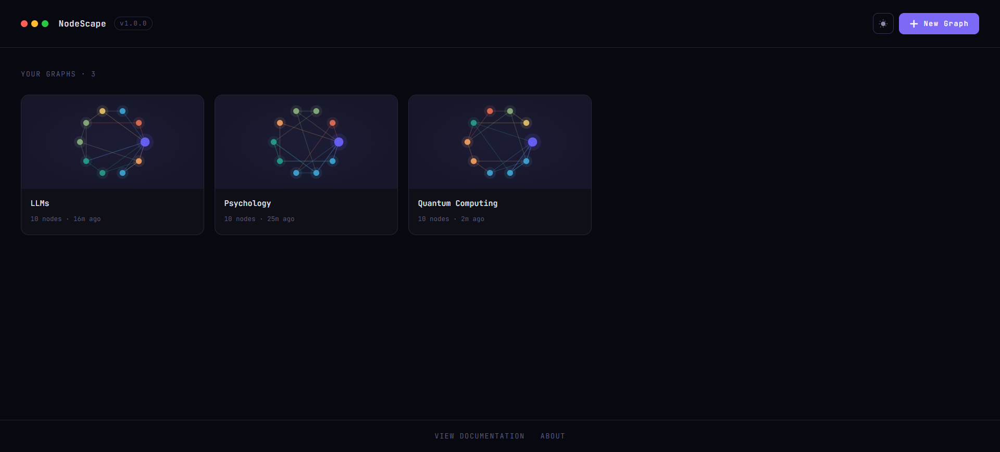
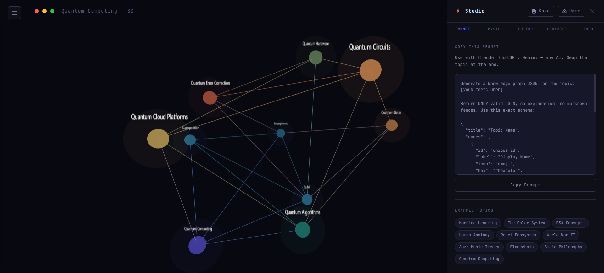
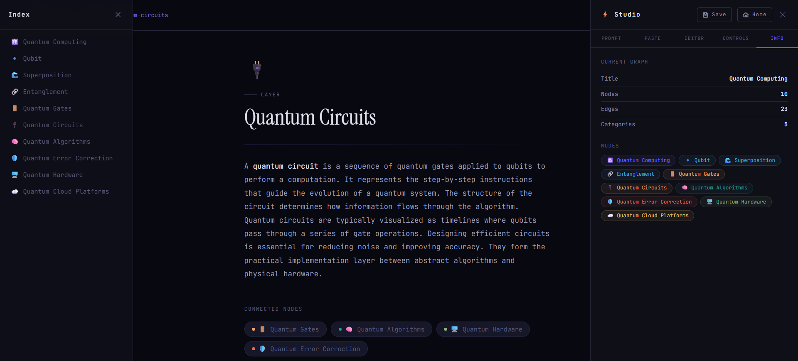

# 🌌 NodeScape

<p align="center">
  <i>"Explore a subject like a galaxy."</i>
</p>

<p align="center">
  
  
  
  
</p>

<p align="center">
  <strong>NodeScape</strong> — Explore knowledge in 3D. It is a fast, visually stunning 3D knowledge graph visualizer and editor. <br/>
  Is is an interactive Three.js knowledge graph visualizer powered by AI-generated data.
</p>

<p align="center">
  
</p>

---

## ✨ Features & UI Components

### 🏡 Homepage & Graph Library
The homepage acts as a visually appealing library. All graphs are saved natively to your browser's local storage. This functions as a dynamic, offline library for your visualized subjects. You can rename, delete, or load existing graphs directly from the card interfaces.

### 🌌 3D Graph Viewer
Seamlessly rotate, pan, and zoom through complex subjects in 3D space. 
- **Desktop:** Click & drag to rotate, Shift+drag or right-click to pan, scroll to zoom.
- **Mobile:** Adaptive on-screen D-Pad interface for panning, intuitive pinch-to-zoom, and touch rotation.

<p align="center">
  
</p>

### 📄 Detailed Node Page View
Clicking on any node smoothly transitions you into a detailed full-screen "Page View" representing the core concept. These pages support markdown-style rich formatting to display in-depth content. Nodes can link to each other, allowing you to seamlessly surf through subjects directly from within the pages!

<p align="center">
  
</p>

### 🎛️ AI Data & Tool Sidebars
NodeScape features two vital sidebars in the 3D space:
1. **AI Data Sidebar (Right):** Access your **Prompt** templates to copy-paste into an LLM. Paste JSON results directly into the **Paste** tab to generate the graph instantaneously. Use the **Editor** tab for live access to the raw internal JSON—surgically add, modify, or remove nodes any time. Toggle various visual graph settings in the **Controls** tab.
2. **Node Index Sidebar (Left):** Easily scan and find nodes through a clean hierarchical index list.

### 🎨 Glassmorphic Interface
Gorgeous Framer-Motion driven UI packed with rich aesthetic transitions and a sleek dark/light mode engine.

## 🛠️ Tech Stack

Built for extreme performance, scale, and modern UI practices.

- **Frontend Framework**: [React](https://reactjs.org/) & [TypeScript](https://www.typescriptlang.org/) for robust architecture.
- **3D Graphics**: [Three.js](https://threejs.org/) powering the custom high-performance WebGL rendering.
- **Layout & Physics**: [d3-force-3d](https://github.com/vasturiano/d3-force-3d) safely calculates the massive N-body simulation layouts in 3D.
- **Animations**: [Framer Motion](https://www.framer.com/motion/) for state-driven micro animations.
- **Styling**: [Tailwind CSS](https://tailwindcss.com/) for a scalable, sleek design language.

## 🚀 Getting Started

### 🌟 Live Demo

NodeScape is hosted live! You can try out the application directly in your browser:  
[**Try NodeScape on Vercel**](https://your-vercel-project-link.vercel.app/)

### 1. Installation

Clone the repository and install the dependencies:

```bash
git clone https://github.com/your-username/nodescape.git
cd nodescape
npm install
```

### 2. Development Server

Start up the local Vite dev server:

```bash
npm run dev
```

Navigate to `http://localhost:5173` to experience NodeScape.

## 🧠 How To Use

1. **Create an AI Prompt**: In the application sidebar, copy the **AI Prompt**.
2. **Generate Data**: Paste this prompt into ChatGPT, Claude, or any LLM of your choice and provide a topic you'd like to explore.
3. **Visualize**: Take the JSON output from the AI, go back into NodeScape, and paste it into the **Paste** tab.
4. **Explore & Save**: Pan around the 3D space to explore, edit what you need, and hit the **Save** button to store it in your library.

## 🔮 Future Roadmap

NodeScape is constantly evolving. The ultimate vision is to transform NodeScape into a fully autonomous **Agentic Graph Maker**.

- 🐳 **Local & Cloud AI Generation:** We plan to integrate an embedded **Ollama** model directly into the application to generate custom 3D knowledge nodes completely on the fly using local AI. Additionally, support for connecting directly to **Cloud AI APIs** (like OpenAI, Anthropic) is planned for automatic generation without the need for manual copy-pasting.
- 📄 **Document Knowledge Extraction:** In the future, you will be able to upload PDFs, images, and other document types directly into NodeScape. The system will automatically process these files, extract deeply nested knowledge, and instantly generate the corresponding nodes and edges to visualize the document's concepts.
- 🌱 **Self-Expanding Webs:** Nodes will have the ability to "autonomously think" and fetch missing gaps of knowledge without requiring manual prompts.
- 🗄️ **Persistent Database:** Transitioning from browser local storage to an actual, robust database system to save graphs securely and seamlessly across multiple devices.
- ⚙️ **Dedicated AI Backend:** Building a separate back-end architecture specifically designed to interface with various AI models and services securely and efficiently.

---

<p align="center">
  Built by <strong>Arjun S Nair</strong>
</p>
