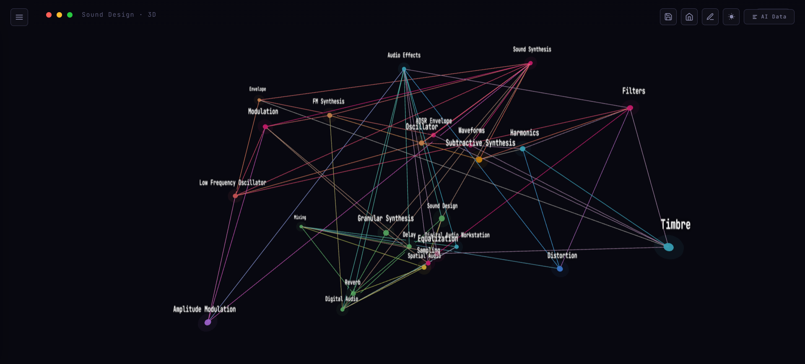
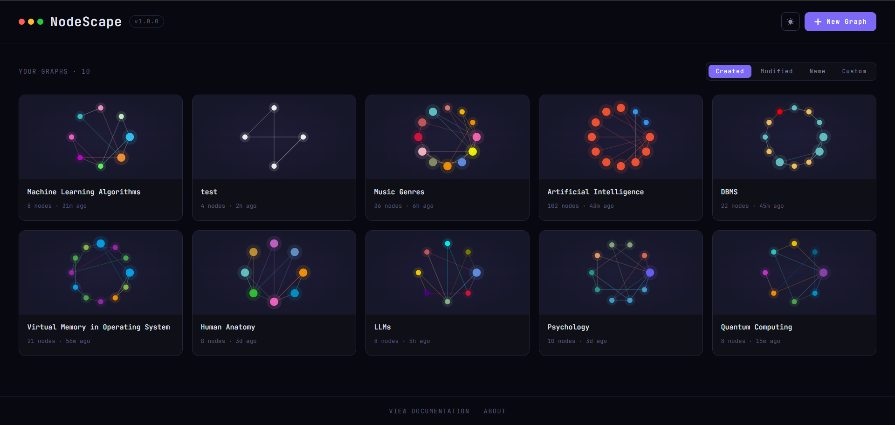
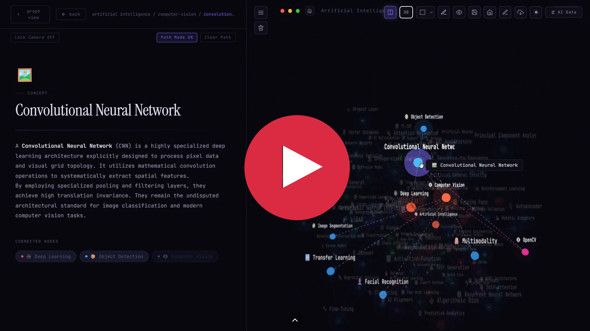
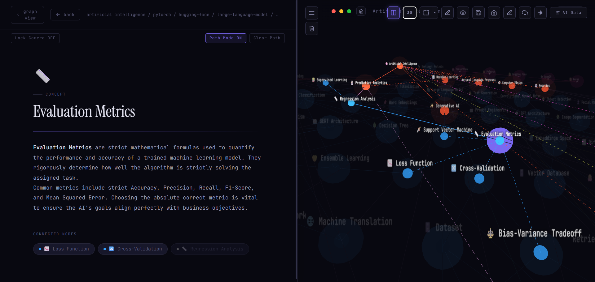
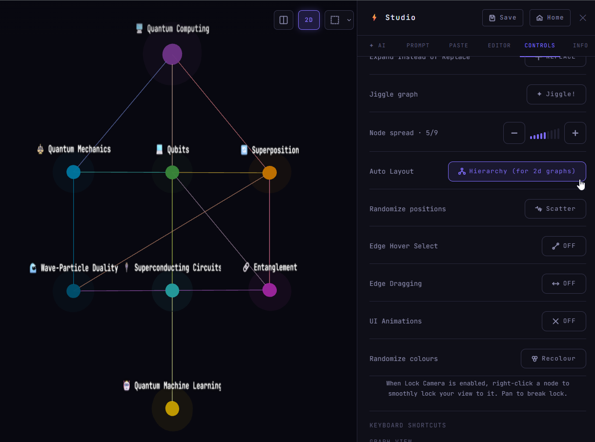
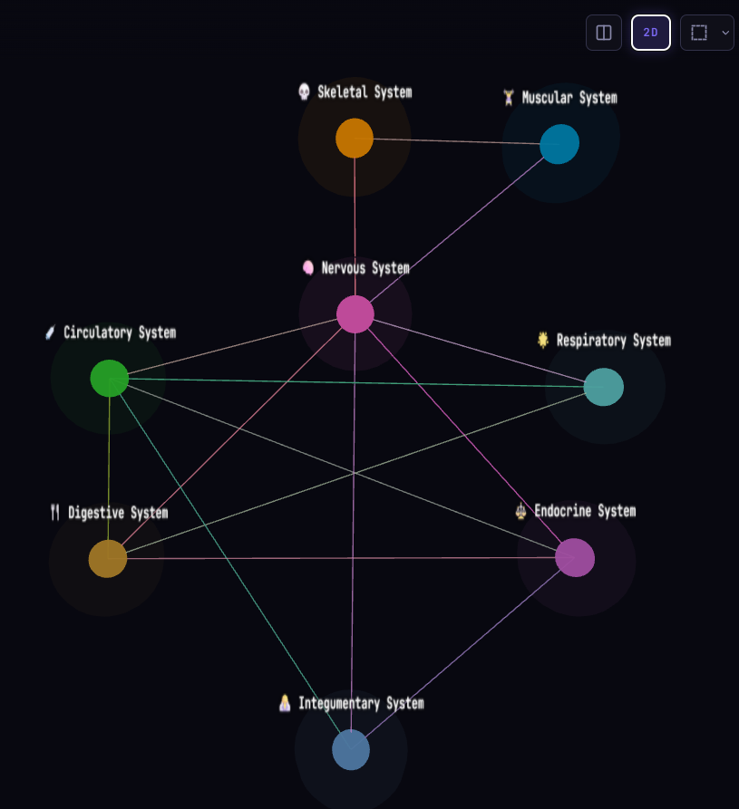
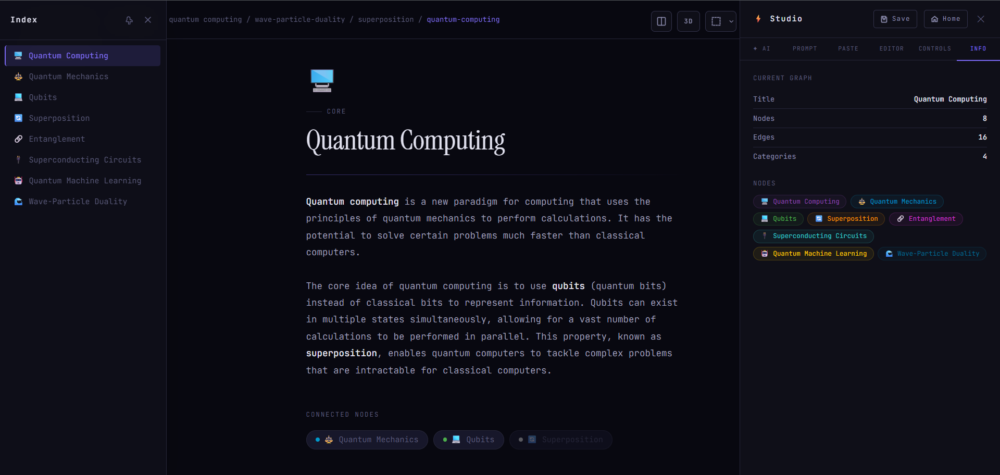

<h1 align="center">🌌 NodeScape v1.0.0</h1>
<p align="center">
  <i>"Explore knowledge like a galaxy of interconnected ideas."</i>
</p>

<p align="center">
  
  
  
  
</p>

<p align="center">
  NodeScape is an interactive AI-powered spatial knowledge graph explorer that combines visualization, note-taking, and idea exploration into a dynamic network of interconnected concepts, transforming concepts into a navigatable 3D/2D universe.
</p>

<p align="center">
  
</p>

---

# ✨ Features

## 🏡 Graph Library

NodeScape includes a **visual homepage** that acts as a personal graph library.

Graphs are stored locally in your browser using **local storage**, making NodeScape an **offline-first knowledge workspace**.

<p align="center">
  
</p>

You can:

- create new knowledge graphs
- rename or delete existing graphs
- reopen graphs instantly
- maintain multiple concept maps

---

# 💻 Demo: Using the graph view in combination with path mode

[](https://www.youtube.com/watch?v=R8EsM01ls-Y)

---

# 🌌 Knowledge Graph Explorer

Navigate complex subjects inside a **fully interactive graph environment**.

NodeScape supports both:

- **3D exploration**
- **2D structured layout**

This allows users to explore concepts spatially or in a structured hierarchy.

### Desktop Controls

| Action | Result |
|------|------|
Drag | Rotate graph |
Shift + Drag / Right Drag | Pan camera |
Scroll | Zoom |
Middle Drag | Zoom camera |
Arrow Keys | Pan camera |
Shift + Arrow | Rotate camera |
Drag Node | Move node |
Middle Click Node | Lock camera to node |

<p align="center">
  
</p>

---

# 🧭 Path Mode (Guided Knowledge Navigation)

NodeScape introduces a **Path Mode** that transforms the graph into a guided learning experience.

When enabled:

• the camera locks onto the current concept  
• visited nodes form a **breadcrumb path**  
• unvisited nodes appear as **dotted connections**  
• unrelated parts of the graph are **dimmed**

This turns the graph into a **learning pathway instead of a chaotic network**.

Users can explore concepts through:

- the **3D graph**
- **connected node buttons**
- the **node index sidebar**
- breadcrumb navigation

<p align="center">
  
</p>

---

# 🧬 Hierarchy Layout

Large graphs can be difficult to understand.

NodeScape includes a **Hierarchy Layout system** that organizes nodes into levels.

This helps visualize structures such as:

```

Artificial Intelligence
└ Machine Learning
└ Neural Networks
└ CNN

```

The hierarchy system works with both **2D and 3D modes**, helping reveal relationships between:

- concepts
- techniques
- applications
 
<p align="center">
  
</p>

---

# 🧊 2D Mode

For structured exploration, NodeScape includes a **2D projection mode**.

This mode:

- flattens the graph
- reveals hierarchical layers
- makes large knowledge maps easier to read

Users can switch freely between **2D and 3D views**.

<p align="center">
  
</p>

---

# 📄 Node Pages (Concept Notes)

Clicking a node opens a **detailed concept page**.

Each node functions like a **knowledge card** containing:

- formatted notes
- contextual information
- links to related nodes
- Breadcrumb navigation (browser-style navigation) for nodes
- Address bar

<p align="center">
  
</p>

This creates a hybrid system between:

```

knowledge graph
+
note-taking system

```

---

# 🧠 Exploration-Focused Design

NodeScape is designed to make learning feel like **exploring a map** rather than reading a document.

Key ideas include:

- spatial memory
- visual connections
- concept clustering
- exploration paths

Instead of scrolling through notes, users **navigate through ideas**.

---

# 🏛️ Architecture

<p align="center">
LLM (Llama 3.3 70B)<br>
↓<br>
Structured JSON Knowledge Graph<br>
↓<br>
NodeScape Parser<br>
↓<br>
3D Graph Renderer (Three.js + d3-force-3d)
</p>

AI generates structured concept graphs which NodeScape converts into an **interactive knowledge universe**.

---

# 🎛️ AI Tools & Data Sidebars

NodeScape includes two powerful sidebars.

### AI Data Sidebar (Right)

Used to generate and edit graphs.

Features:

- AI chatbot for graph generation
- prompt templates
- paste AI-generated JSON
- raw JSON editor
- graph controls

---

### Node Index Sidebar (Left)

Displays a **hierarchical list of nodes**.

Users can:

- quickly jump to concepts
- explore the graph structure
- open nodes directly

---

# 🎨 Glassmorphic UI

NodeScape features a modern UI built with:

- **Framer Motion**
- **Tailwind CSS**

Features include:

- animated transitions
- glassmorphic panels
- dark / light themes
- fluid UI interactions

---

# 🛠️ Tech Stack

### Frontend

- React
- TypeScript

### Visualization

- Three.js
- d3-force-3d

### Animation

- Framer Motion

### Styling

- Tailwind CSS

---

# 🚀 Getting Started

## 🌟 Live Demo

https://node-scape.vercel.app/

---

## 🧠 How To Create Knowledge Graphs

NodeScape supports **three different ways to build knowledge graphs**, depending on how you prefer to work.

## 🤖 1. Built-in AI Chatbot

The easiest way to generate a knowledge graph.

Use the **AI Chatbot in the right sidebar** to automatically generate structured concept graphs.

Steps:

1. Open the **AI Data sidebar**
2. Ask the chatbot for a topic

Example:

```

Artificial Intelligence
Stoicism
Quantum Computing

```

3. The AI produces structured JSON
4. NodeScape instantly converts it into a **3D knowledge graph**

This is the fastest way to explore new topics.

---

## 🌐 2. External AI (Using Prompt Template)

NodeScape also works with external AI tools such as:

- ChatGPT / Claude / Gemini etc.
- Local LLMs

Steps:

1. Copy the **Graph Generation Prompt** from prompt menu
2. Paste it into your preferred AI model
3. Ask for a topic (change the [TOPIC HERE] in the prompt)
4. Copy the returned json
5. Paste into paste section in paste menu
   
NodeScape will automatically render the graph.

This method allows using **more powerful external models**.

---

## ✏️ 3. Manual Graph Editing

NodeScape also supports **fully manual graph creation**.

Enable **Edit Mode** to:

- create new nodes
- connect nodes
- rename concepts
- write notes
- move nodes in the graph

This allows you to **build custom knowledge maps by hand**, perfect for:

- studying subjects
- planning projects
- mapping ideas
- organizing research

---

These three workflows allow NodeScape to function as both:
AI-powered knowledge generator
+
manual knowledge mapping tool

You can freely mix all three approaches while building your knowledge graphs.

---

# 🌍 Why NodeScape Exists

Most knowledge tools are **linear**.

Notes look like this:

```

Topic
├ Subtopic
├ Subtopic
└ Subtopic

```

But real knowledge does **not grow linearly**.
Concepts connect across subjects, forming **networks of ideas**.

For example:

```

Artificial Intelligence
├ Machine Learning
│  ├ Neural Networks
│  │  ├ CNN
│  │  └ Transformers
│  └ Clustering
├ Robotics
└ Computer Vision

```

Traditional notes make it difficult to **see these relationships**.
You scroll through pages of text instead of **exploring how ideas connect**.
NodeScape was built to solve this problem.

Instead of reading knowledge like a document, NodeScape lets you:

- **navigate ideas spatially**
- **see how concepts relate**
- **explore topics naturally**
- **build personal knowledge maps**

It treats knowledge like a **landscape**, not a list.
You don’t just read information — you **explore it**.

---

# 🔮 Future Roadmap

NodeScape is evolving toward becoming a **self-expanding knowledge engine**.

## ☁️ Cloud Backend (Supabase)

Future versions of NodeScape will introduce a **Supabase-powered backend** to support persistent and collaborative knowledge graphs.

Planned capabilities include:

• **Cloud graph storage** – save graphs securely in a hosted database  
• **User authentication** – personal graph libraries linked to accounts  
• **Cross-device sync** – access your knowledge maps from anywhere  
• **Collaborative graphs** – multiple users editing the same graph  
• **Graph version history** – track how knowledge maps evolve over time  
• **Shared public graphs** – publish and explore community knowledge maps  

Supabase provides:

- PostgreSQL database
- authentication
- real-time updates and multi-device sync
- storage for graph assets

This will allow NodeScape to move beyond local storage and become a **cloud-based knowledge mapping platform**.

---

### 🔍 Graph Search

Search nodes by:

- title
- tags
- content
  
---

### 📄 Knowledge Extraction

Upload:

- PDFs
- Images
- Documents

Automatically convert them into **knowledge graphs**.

---

### 🤖 Other External AI Integration

- Ollama local models
- OpenAI / Anthropic API integration

---

### 🌱 Self-Expanding Graphs

Nodes can dynamically generate:

- missing concepts
- deeper subtopics
- related ideas

---

### 🌌 Visual Enhancements

- bloom & glow effects
- clustering of related nodes
- automatic domain grouping
- smarter layouts for large graphs

---

### Other Future Roadmaps

- Snapshots for graphs (Sub-Library for internal states of graphs, tracks changes, progress of users) 
- Arrow marks for showing directions between nodes
- New object: Relationships (Shows how a node connects to another node huge change, for NodeScape V2
eg:-
```
(Human body) -> | has | -> (heart)
      ^            ^          ^
      |            |          |
      |            |          |
     node     Relationship   node   
```

- Encapsulation of nodes (universe inside another universe):- node contains subgraph
- branches (parallel universe)
- clustering (implement a tag system)
- Coloring nodes which are similar
- Legends for the map [uses colored nodes]
- Planet / Space mode:- Use displacement mapping generated by ai to create dynamic worlds which are explorable/walkable in first-person (walk through a planet of your knowledge), fly from planet to planet for switching topics (not really useful, just for fun)(NodeScape V4 feature)
- Real-time collaboration for graph creation
(Nodescape V3 feature)
```
websockets
conflict resolution
state syncing
```
allows users to build idea worlds together, see what paths each are taking
- Neo4j or ArangoDB database for storage in far future
- Django api server for ai features
- Mobile version in React Native
 (Nodescape V3)

---

The primary focus are anything that improves the core mechanism: understanding, navigation
learning flow 

---

# 👨‍💻 Built by

**Arjun S Nair**
